<p align="center">
  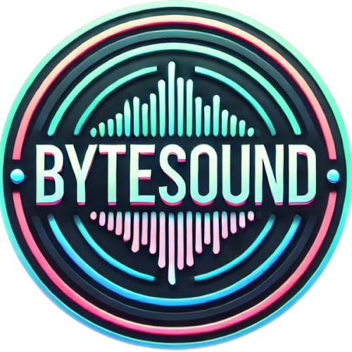
</p>

<h1 align="center">ByteCut Director</h1>

<p align="center"><strong>AI Video Production Tool — by ByteSound</strong></p>

ByteCut Director is a production workspace for managing AI-generated video workflows. It organizes your shots, reference images, prompts, audio, and generation parameters into a streamlined pipeline — then exports everything as a ready-to-upload ZIP for **Wan2GP** so that generation pipeline is a breeze...

Instead of manually building queue files, juggling filenames, and tracking which video version goes with which shot — ByteCut Director handles all of it in one place.

> [**Wan2GP**](https://github.com/deepbeepmeep/Wan2GP) is a Gradio-based UI for running AI video generation models. ByteCut Director is built for Wan2GP **v10.60+** with the **LTX-2 DEV 19B Distilled** model.

---

## What It Does

1. **Organize** your video into sections and shots, each with timing, lyrics, and descriptions
2. **Attach** reference images (start + end frames), audio tracks, and text prompts to each shot
3. **Configure** 70 LTX-2 generation parameters globally or per-shot with a cascading override system
4. **Import** generated videos back in, with automatic filename matching and version history
5. **Review** videos with hover-to-play previews directly on the storyboard
6. **Export** selected shots as a `queue.zip` ready for batch generation

---

## Features

### Shot Management

- **Solo** shots — single continuous clip from one reference image
- **Multi** shots — multiple takes/angles of the same concept, each with their own ref images and videos
- Sections with drag-to-reorder, rename (double-click), and per-section shot grouping
- Shot duplication, insert-after, and bulk management

### Storyboard & Timeline

- **Storyboard view** — grid of shot cards with status dots (IMG, END, AUD, LTX, VID, OK)
- **Timeline view** — horizontal layout with zoom, pan (Space+drag), and section color-coding
- Alternating section backgrounds for visual separation

### Reference Images

- Upload or browse from folders, drag-and-drop onto shots
- **Start + End** reference images for smooth I2V transitions
- 384px thumbnail system (~500x size reduction for fast browsing)
- Full-size lightbox for detailed review

### Video Review

- **Hover-to-play** — thumbnail plays the video on mouse hover, resets on hover-out
- **No-image fallback** — shots without images but with videos show a paused first frame
- **Take tags** — Multi shots show hoverable pills per take; hover plays that take's video
- **Versioning** — every import appends (never replaces), navigate with `← v2/3 →` controls

### LTX-2 Parameters

- **Quick Settings** (always visible) — Resolution (20 presets grouped by 1080p/720p/540p/480p), Video Length (up to 700 frames), Force FPS (15–50), with a live duration preview
- **Advanced params** — organized into collapsible groups (Guidance, Audio, Sliding Window, NAG/SLG/APG, etc.)
- **Cascade system** — defaults → project-level overrides → per-shot overrides
- Per-shot overrides highlighted in crimson with one-click reset to global

### Export

- Filter shots by status (has image, has prompt, approved)
- Select which shots to include
- Exports a `queue.zip` containing:
  - `queue.json` with all parameters and file references
  - Start/end reference images
  - Audio tracks
- Ready for direct upload to LTX-2 or Wan2GP batch processing

### Audio

- Upload audio tracks and assign to shots
- Waveform visualization
- Region cropping for precise audio segments

---

## Getting Started

### Prerequisites

- [Node.js](https://nodejs.org/) 18 or higher

### Install

```bash
git clone https://github.com/heheok/bytecut-director.git
cd bytecut-director
npm install
```

### Run

```bash
npm run dev
```

This starts both the frontend (Vite on [localhost:5173](http://localhost:5173)) and backend (Express on port 3001) simultaneously. Open your browser to **http://localhost:5173**.

### Other Commands

```bash
npm run dev:client   # Frontend only
npm run dev:server   # Backend only
npm run build        # Production build
npm run preview      # Preview production build
```

### Windows Notes

If you run into native module issues on Windows:

```bash
npm install @rollup/rollup-win32-x64-msvc
npm install --os=win32 --cpu=x64 sharp
```

---

## Usage Guide

### 1. Create or Load a Project

When you open ByteCut Director, the welcome screen lets you create a new project or load an existing one.

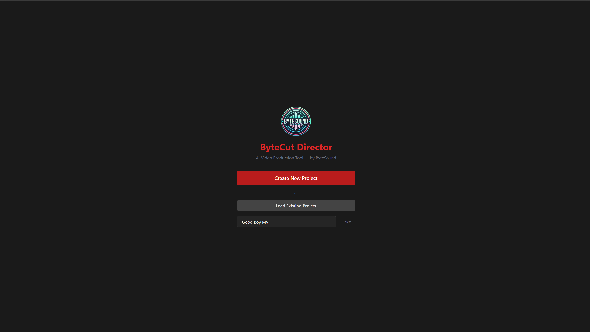

Click **Create New Project**, give it a name, and you're in.

### 2. Build Your Storyboard

The **Storyboard** is your main workspace. Your project is organized into **sections** (e.g. Intro, Verse 1, Chorus) and each section contains **shots**.

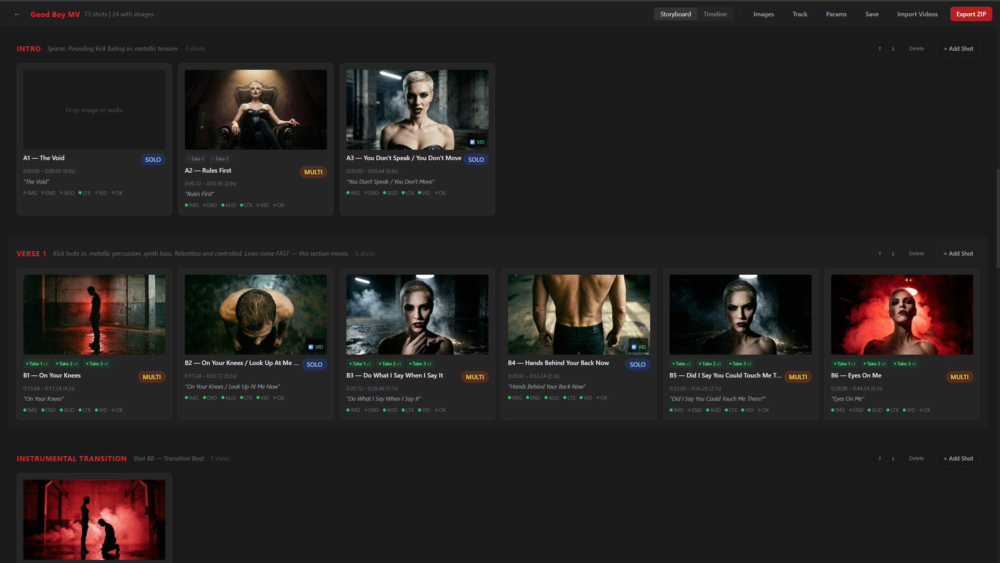

- Click **+ Add Shot** on the right side of any section to add a new shot
- Double-click a section name to rename it
- Each shot card shows a thumbnail, its prompt, type badge (**SOLO** or **MULTI**), and status dots

**Status dots** at a glance: **IMG** (has start image), **END** (has end image), **AUD** (has audio), **LTX** (has generation prompt), **VID** (has video), **OK** (approved).

### 3. Load Your Track

For music video workflows, click **Track** in the toolbar to open the audio track panel at the bottom. Load the full-length audio of your video — this can be the full mix with all instruments, or just the vocal stem if you want tighter lipsync from LTX-2 (even without a vocal stem, the Wan2GP LTX-2 workflow can extract vocals automatically if you enable it in the parameters).

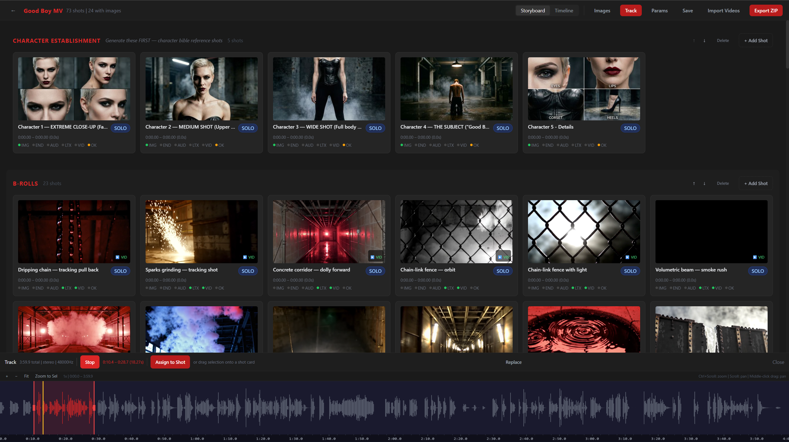

Once loaded, you'll see the waveform. Zoom in, select a region, and assign it directly to a shot — the selected audio section is split and saved as a separate WAV file for that shot.

There's also a shortcut: if your shots already have start and end times set, selecting a shot while the Track panel is open will automatically highlight that shot's time region on the waveform. From there, one click assigns the audio.

### 4. Edit a Solo Shot

Click any shot to open the **Shot Editor** on the right. For a **Solo** shot, you'll see fields for prompt, lyrics, concept, and reference images.

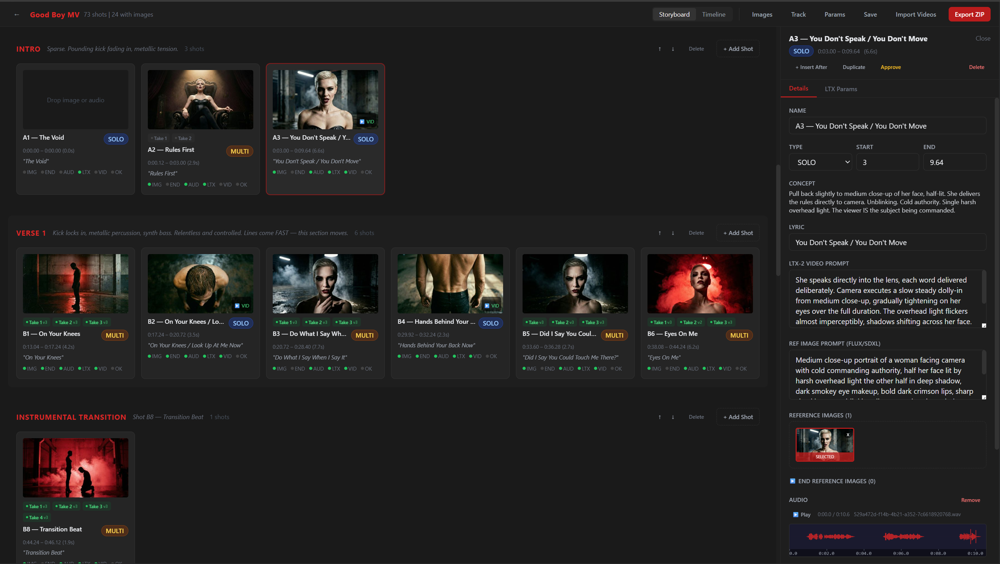

- Write a detailed prompt describing what the AI should generate
- Assign **start** and optionally **end** reference images for image-to-video generation
- The shot's status dots update as you fill in each piece

### 5. Work with Multi Shots

A **Multi** shot contains multiple **takes** — different angles or variations of the same concept. Each take has its own ref images, prompt, and video.

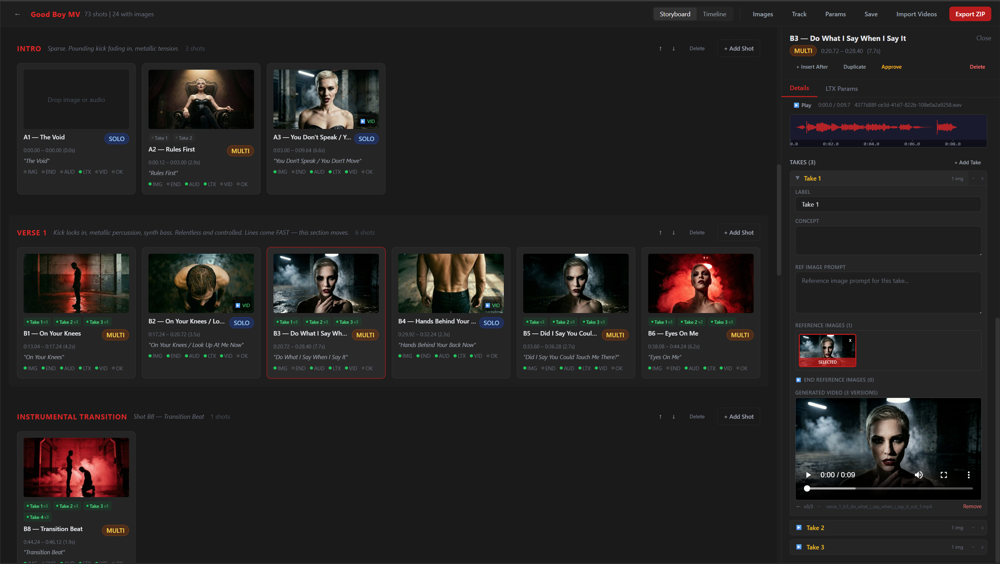

- Switch between takes using the tabs at the top of the editor
- Each take has its own reference images and prompt, and exports as a separate generation job in the queue
- Hover over take pills on the storyboard card to preview that take's video

### 6. Manage Reference Images

Click **Images** in the toolbar to open the **Image Manager** at the bottom of the screen.

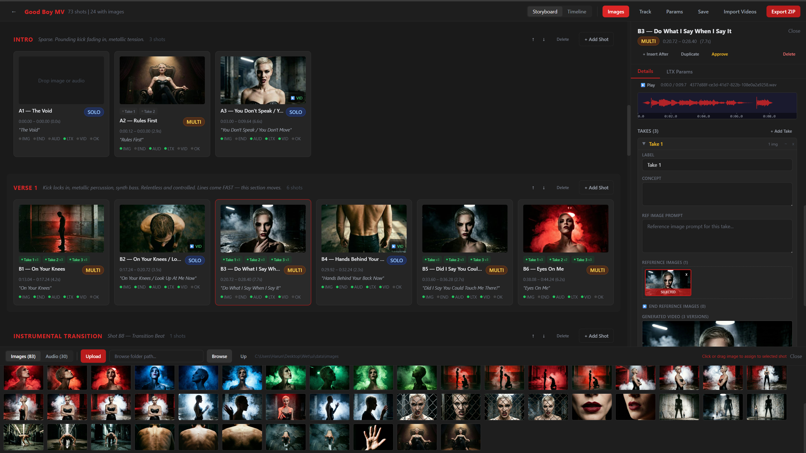

- Upload images or browse any folder on your machine
- Click an image to assign it to the currently selected shot
- Drag and drop images directly onto shot cards on the storyboard
- Switch to the **Audio** tab to upload and manage audio tracks

### 7. Configure Generation Parameters

Click **Params** in the toolbar to open the **Global LTX-2 Params** editor. These defaults apply to all shots unless overridden.

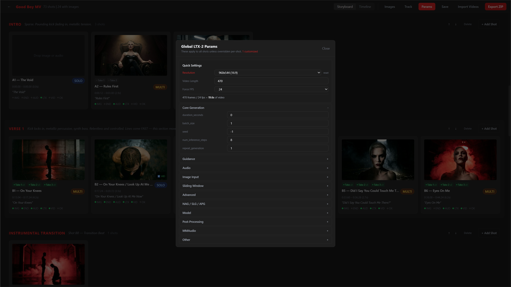

**Quick Settings** are always visible at the top:

- **Resolution** — choose from 20 presets (1080p, 720p, 540p, 480p)
- **Video Length** — number of frames (up to 700)
- **Force FPS** — 15, 16, 23, 24, 25, 30, or 50

Below that, advanced parameters are organized into collapsible groups (Core Generation, Guidance, Audio, Sliding Window, etc.).

### 8. Override Parameters Per Shot

Any shot can override the global defaults. In the shot editor, scroll down to the params section and change a value — it turns **crimson** to indicate it's overridden.

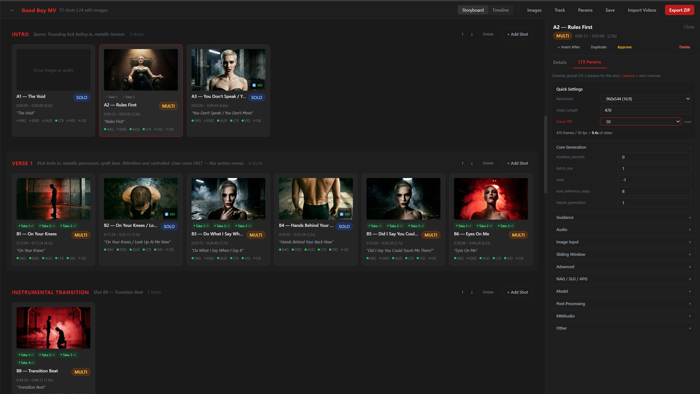

Click the reset button next to any overridden value to revert it to the global default. This cascade system (`defaults → project globals → per-shot`) lets you set it once and override only where needed.

### 9. Export a Queue ZIP

When your shots are ready, click **Export ZIP** in the toolbar to open the export panel.

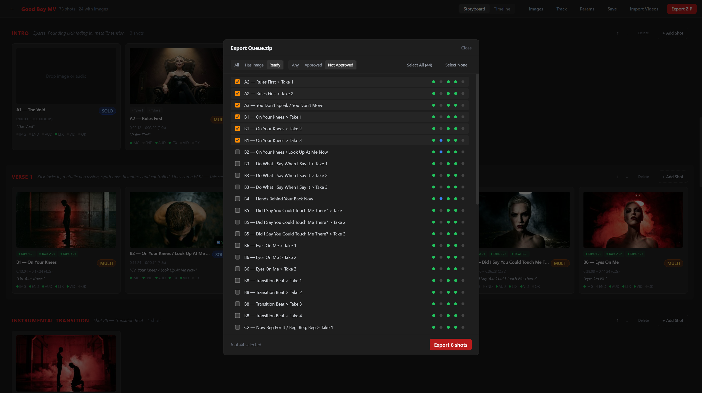

- Filter by status: Ready, All, Approved, Not Approved
- Check/uncheck individual shots to include or exclude them
- Click **Export** to download a `queue.zip` containing `queue.json`, reference images, and audio — ready to upload to Wan2GP

### 10. Load the Queue in Wan2GP

> **Note:** ByteCut Director is designed for [Wan2GP](https://github.com/deepbeepmeep/Wan2GP) **v10.60+** with the **LTX-2 DEV 19B Distilled** model.

Once you have the exported `queue.zip`, open Wan2GP in your browser. On the right side, expand the **Queue Management** section at the bottom, then click **Load Queue** and select your ZIP file.

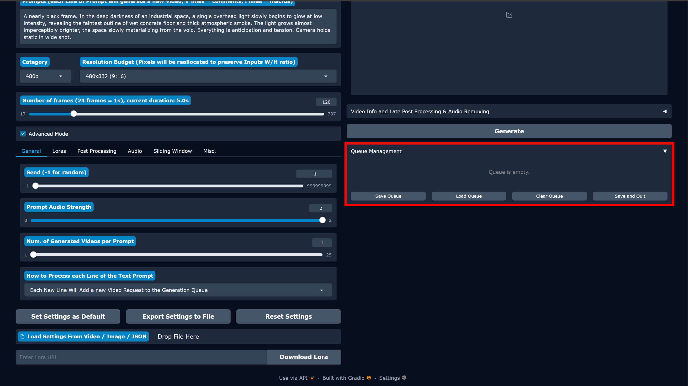

Wan2GP will load all your shots and automatically start processing the generation queue.

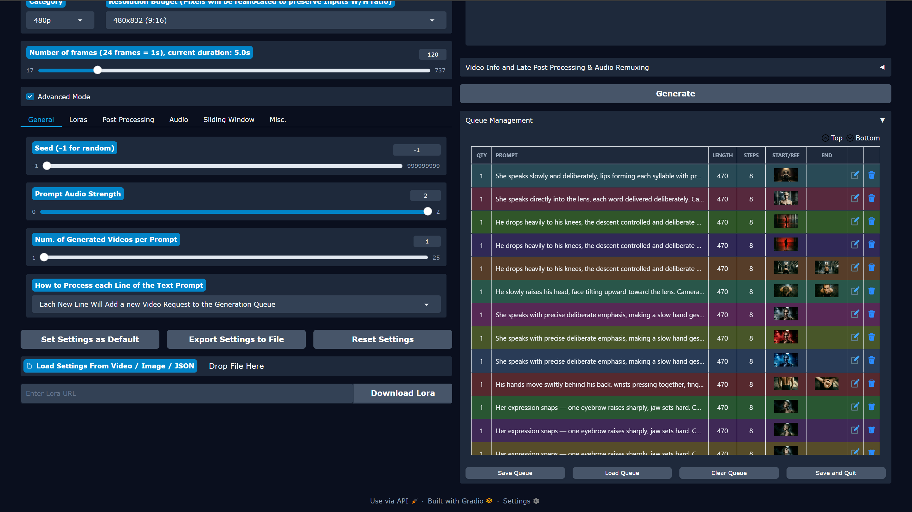

Once all videos are generated, they'll be in Wan2GP's output folder — ready to import back into ByteCut Director.

### 11. Import Videos Back

After your videos are generated, click **Import Videos** to bring them back in.

**Step 1** — Browse to Wan2GP's output folder:

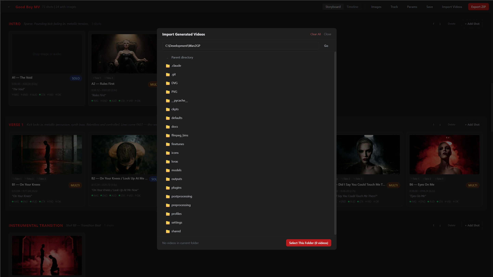

**Step 2** — Navigate into the output subfolder and select it:

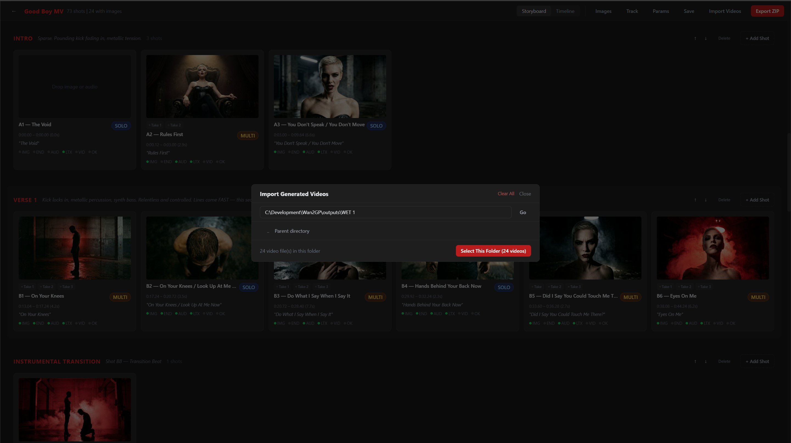

**Step 3** — ByteCut Director auto-matches each video file to the correct shot by filename. Green = matched, review the list, then click **Import**:

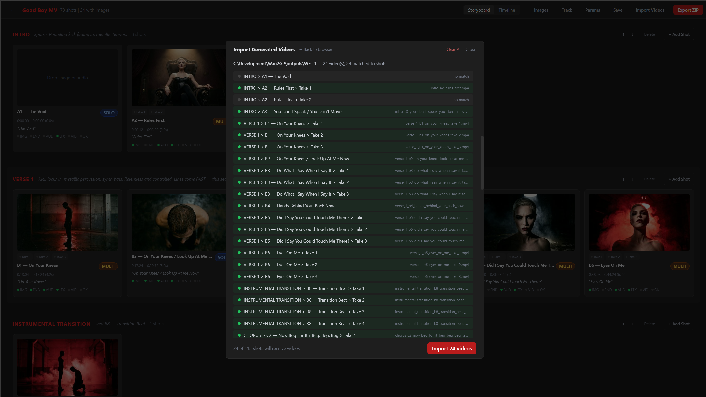

Imported videos are appended as new versions — previous versions are kept, and you can navigate between them with `← v2/3 →` controls in the shot editor.

### 12. Timeline View

Switch to **Timeline** view in the toolbar for a horizontal layout of your entire project, useful for seeing the big picture and checking timing across sections.

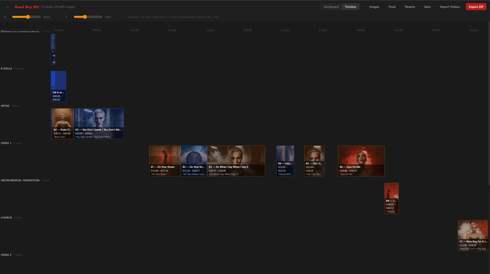

Use the zoom slider and Space+drag to pan around.

---

## Project Structure

```
ui/
├── src/
│   ├── components/
│   │   ├── Layout/          # WelcomeScreen, Toolbar
│   │   ├── Storyboard/      # Grid view, ShotCard
│   │   ├── Timeline/        # Horizontal timeline
│   │   ├── ShotEditor/      # Shot details, TakeEditor, params editors
│   │   ├── ImageManager/    # Upload, browse, lightbox
│   │   ├── AudioCropper/    # Waveform, region selection
│   │   ├── Export/          # Shot selection, ZIP export
│   │   └── VideoImport/     # Folder browser, auto-matching
│   ├── stores/
│   │   ├── projectStore.ts  # Main state (shots, images, audio, video, params)
│   │   └── uiStore.ts       # UI state (selection, panels, view mode)
│   ├── types/
│   │   └── project.ts       # TypeScript interfaces + default params
│   └── utils/               # API client, filename matching, time formatting
│
├── server/
│   ├── index.ts             # Express server setup
│   ├── routes/              # project, images, audio, videos, export
│   └── utils/               # ZIP builder, markdown parser
│
├── data/                    # Runtime data (not committed)
│   ├── projects/            # Saved project JSON files
│   ├── images/              # Uploaded images + thumbs/
│   └── audio/               # Uploaded audio files
│
└── public/
    └── logo.png             # ByteSound logo
```

---

## How Video Matching Works

When you import videos from a folder, ByteCut Director uses 3-phase matching to automatically assign them to the right shots:

1. **Exact match** — filename stem matches the expected `Section_Shot` or `Section_Shot_Take` pattern
2. **Relaxed match** — strips `_(2)`, `_(3)` dedup suffixes that LTX/Wan2GP add, and maps ordinals to expected numbering
3. **Prefix match** — handles truncated filenames (common with long shot names) by matching the first 20+ characters

Each import appends as a new version — nothing gets overwritten.

---

## Data Model

```
Project
├── name, id
├── defaultParams (LTXParams)   ← project-level defaults
└── sections[]
    ├── name
    └── shots[]
        ├── type: "solo" | "multi"
        ├── startTime, endTime
        ├── prompt, lyric, concept
        ├── refImages[]           ← start frame references
        ├── endRefImages[]        ← end frame references
        ├── audioFile
        ├── videoFiles[]          ← versioned video imports
        ├── params (Partial)      ← per-shot overrides
        └── takes[] (multi only)
            ├── label, concept, refImagePrompt
            ├── refImages[], endRefImages[]
            └── videoFiles[]
```

Parameters cascade: `defaults` → `project.defaultParams` → `shot.params`

---

## Tech Stack

| Layer    | Tech                       |
| -------- | -------------------------- |
| Frontend | React 18, TypeScript, Vite |
| Styling  | Tailwind CSS (dark theme)  |
| State    | Zustand                    |
| Backend  | Express.js                 |
| Images   | Sharp (thumbnails)         |
| Export   | Archiver (ZIP)             |
| IDs      | UUID v4                    |

---

## License

MIT
